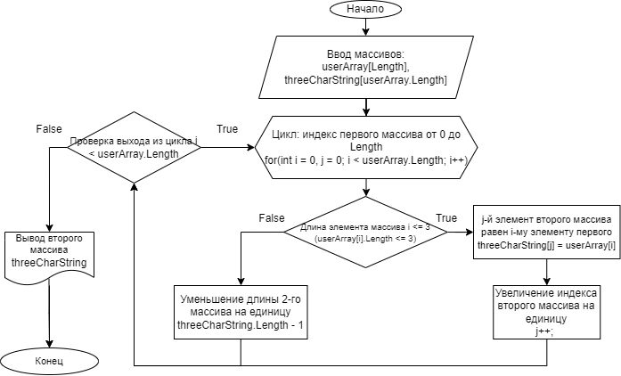

# Итоговая проверочная работа первого блока обучения

* **Задача**: написать программу, которая из имеющегося массива строк формирует массив из строк,
длинна которых меньше либо равна 3 символа. Первоначальный массив можно ввести с клавиатуры,
либо задать на старте выполнения алгоритма. При решении не рекомендуется пользоваться коллекциями,
лучше обойтись исключительно массивами.\
*Примеры*:
```
["hello", "2", "world", ":-)"] -> ["2", ":-)"]
["1234", "1567", "-2", "computer scince"] -> ["-2"]
["Russia", "Denmark", "Kazan"] -> []
```




Описание работы программы:
На входе инициализируются два массива равной длины, первый массив инициализируется функцией пользовательского ввода, ввод выполняется пользователем или задаётся переменной text внутри функции UserInputArray. Пользователю предлагается ввести элементы массива через запятую или пробел. 
``` 
public static string[] UserInputArray(string message)
        {
            Console.WriteLine(message);
            char[] SplitChar = new char[] { ',', ' ' };          // Массив символов разделителей
            string text = Console.ReadLine();                    //Пользовательский ввод
            string[] words = text.Split(SplitChar, StringSplitOptions.RemoveEmptyEntries);
            return words;
        }
```
Второй массив инициализируется функцией ThreeCharString его, она выполняет циклический перебор по всем элементам первого массива и при условии что длина i-го элемента первого массива меньше или равна 3 символа записывает i-й элемент первого массива в j-й элемент второго массива, а ткаже увеличивет индекс второго массива на единицу. Если условие ложно то индекс j-го элемента не изменяется, а длина массива укорачивется на единицу. В конце цикла функция возвращает строковый массив. 
```
public static string[] ThreeCharString(string[] array)        
        {
            string[] threeCharString = new string[array.Length];                    //Создаем массив длиной равной длине принимаемого аргумента
            for (int i = 0, j = 0; i < array.Length; i++)                           //Циклически перебираем от 0 до последнего элемента принимаемого аргумента
            {
                if (array[i].Length <= 3)                                           //если длина i-го элемента меньше или равна
                {
                    threeCharString[j] = array[i];                                  //элемент второго массива равен элементу первого
                    j++;                                                            //увеличиваем индекс второго массива на единицу   
                }
                else
                {
                    Array.Resize(ref threeCharString, threeCharString.Length - 1);  //иначе уменьшаем длину второго массива 
                }
            }
            return threeCharString;
        }
```
Затем следует вывод значений:
```
Введите элементы массива через запятую или пробел: 
1 22 333 444 55 123 213123123 231213
[1, 22, 333, 444, 55, 123, 213123123,  231213] -> [1, 22, 333, 444, 55,  123]
```
Графическое представление алгоритма в папке Algoritm.
Реализация алгоритма по пути ThreeCharString